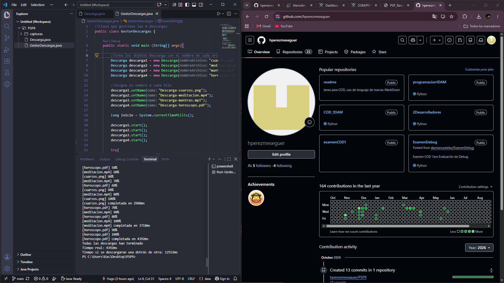
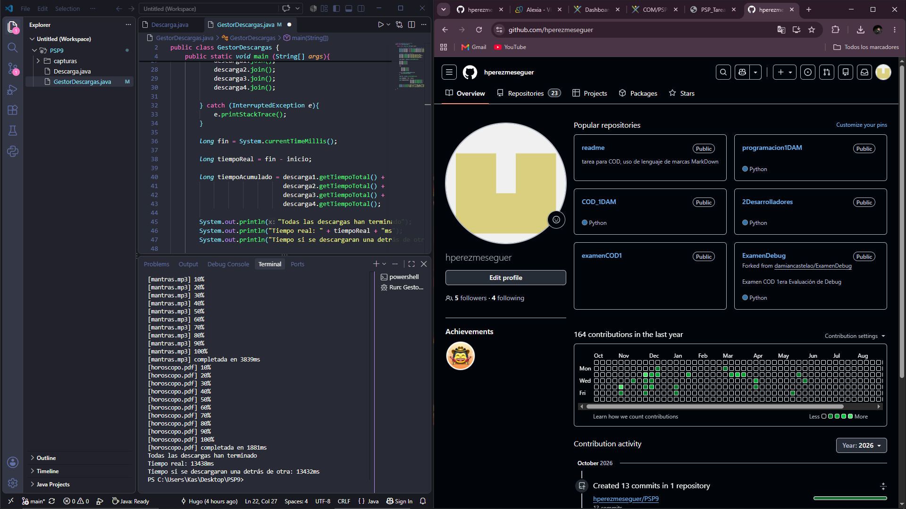

# PSP09

## Niveles Realizados

Solo completé el nivel 1.

## Ejecución Nivel 1

Esto fue lo que hice:

### 1. Creación de clases

He creado dos clases:

- `Descarga`: se encarga de simular la descarga de un archivo.
- `GestorDescargas`: se encarga de crear las descargas, iniciar los hilos y mostrar los resultados finales.

### 2. Creación del constructor

En la clase Descarga he creado un constructor que recibe el nombre del archivo.

El nombre recibido se guarda en el atributo nombreArchivo.

Además, desde el constructor se llama al método tiempoAleatorio() para establecer el tiempo que tardará cada bloque de la descarga.

### 3. Creación método tiempoAleatorio()

El método genera un número aleatorio entre 100 y 500 ms, que será el tiempo que tarda cada bloque de la descarga.

Se llama a este método desde el constructor para que, al crearse cada descarga, ya tenga su tiempo aleatorio guardado
en el atributo `tiempoBloques`.

### 4. Creación del método run()

Es el método encargado de ejecutar la descarga. Para ello, primero guardo el momento en el que empieza la descarga
con `System.currentTimeMillis()` y utilizo un bucle que se repite 10 veces, una por cada bloque del 10%.

En cada repetición utilizo Thread.sleep() para simular el tiempo que tarda en descargarse cada bloque y muestro por 
pantalla el porcentaje de descarga.

Al terminar los 10 bloques, vuelvo a guardar el tiempo con `System.currentTimeMillis()` y calculo cuánto ha tardado 
la descarga utilizando la variable `tiempoTotal`. Para ello, resto el tiempo inicial al tiempo final, y la diferencia obtenida 
es el tiempo que ha tardado en descargarse completamente cada archivo.

### 5. Creación del método getTiempoTotal()

Creé un método getter para poder obtener desde GestorDescargas el tiempo total que ha tardado cada descarga.

### 6. Creación 4 descargas

En la clase `GestorDescargas` creo cuatro objetos de la clase Descarga, uno por cada archivo.

### 7. Asignación de nombres a los hilos

Después de crear las descargas, asigno un nombre a cada hilo utilizando `setName()`.

### 8. Inicio de las descargas

Guardo el momento en el que comienzan todas las descargas y después utilizo `start()` para iniciar cada hilo.

Al utilizar `start()`, las cuatro descargas pueden ejecutarse al mismo tiempo.

### 9. Uso de join()

Después de iniciar los hilos, utilizo `join()` para esperar a que terminen las cuatro descargas.

De esta forma, el programa no continúa con el cálculo de los resultados hasta que todas las descargas hayan terminado.

### 10. Cálculo tiempo real

Cuando terminan todas las descargas, vuelvo a guardar el tiempo y calculo cuánto ha tardado la ejecución completa, al igual que
hice en la clase Descarga.

### 11. Cálculo del tiempo acumulado

Sumo los tiempos individuales de las cuatro descargas para saber cuánto tardarían si se ejecutaran una detrás de otra.

Utilizo la variable `tiempoAcumulado` para guardar esta suma.

## Tabla de resultados

| Ejecución | Descarga más lenta | Tiempo real (ms) | Suma en serie (ms) |
| --------- | ------------------ | ---------------: | -----------------: |
| 1         | `horoscopo.pdf`    |             4392 |              12552 |
| 2         | `cuarzos.png`      |             4978 |              14239 |
| 3         | `horoscopo.pdf`    |             4378 |              14536 |

## Preguntas Nivel 1

- ¿Por qué el tiempo real es mucho menor que la suma?

  El tiempo real es menor porque las descargas se hacen a la vez y representa el tiempo que ha tardado la descarga más lenta. En
  cambio, la suma representa el tiempo que tardarían todas las descargas si se ejecutan de forma secuencial.

- ¿Qué pasa si hago start() y join() dentro del mismo bucle? Muestra el resultado.

  Lo que pasaría es que las descargas se ejecutarían de forma secuencial en vez de hacerla de forma simultánea.

  

## Declaración de IA

Utilicé chatgpt como apoyo para resolver algunos problemas que tuve.

Uno de ellos, fue que los objetos tuvieran guardados el tiempo aleatorio sin tener que recibirlo directamente como parámetro en
el constructor. Le pregunté y me dio varias soluciones, pero opté por la que utilicé finalmente.

También tuve problemas para calcular el tiempo que tardaba en ejecutarse las descargas porque no sabía como poder medir ese tiempo.
La solución que me dio es la utilizar `System.currentTimeMillis()` para capturar el momento inicial en milisegundos.

